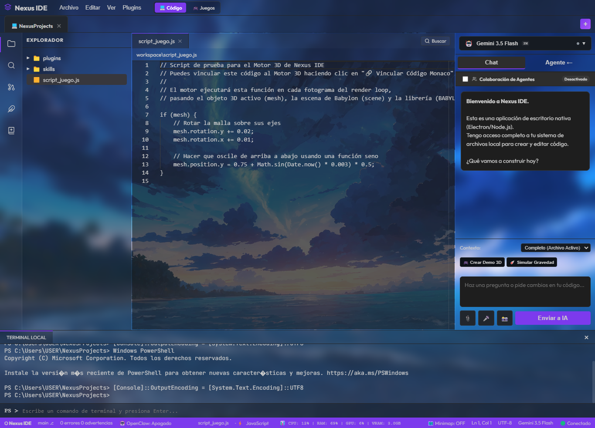
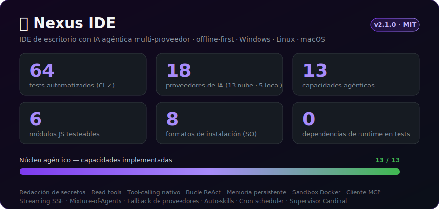
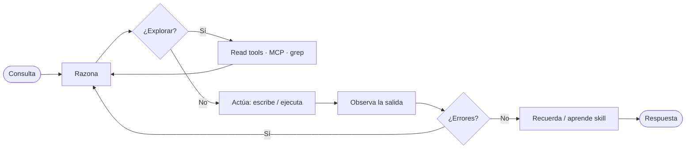

<div align="center">

# 🌌 Nexus IDE

**Entorno de desarrollo de escritorio de última generación: código, IA multi-proveedor, motores 3D y control remoto en una sola ventana.**

[](CHANGELOG.md)
[](https://www.electronjs.org/)
[](https://microsoft.github.io/monaco-editor/)
[](https://www.babylonjs.com/)
[](https://nodejs.org/)
[](#)
[](INSTALL-LINUX.md)
[](LICENSE)



</div>

---

Nexus IDE es un **entorno de desarrollo integrado (IDE) de escritorio** construido sobre **Electron**, **HTML5/CSS3 (Glassmorphism)** y **Node.js**. Combina un rendimiento fuera de línea ultrarrápido con herramientas avanzadas para desarrollo de software, modelado y renderizado 3D, y asistencia interactiva mediante inteligencia artificial multi-proveedor.

## 📊 Nexus IDE en números

<div align="center">




</div>

> Cifras **reales** del repositorio (no benchmarks inventados): `npm test` corre **64 tests** en cada push, el motor soporta **18 proveedores de IA** (13 en la nube + 5 locales) y el núcleo agéntico implementa **13 capacidades**, cubiertas por tests deterministas.

### 🔄 Cómo trabaja el agente

Nexus no solo "responde": **explora el código, actúa, observa el resultado y corrige** — un bucle agéntico real (ReAct):



### 🤖 Capacidades agénticas

| Categoría | Capacidades |
|-----------|-------------|
| **Percepción** | Read tools confinadas al workspace (`READ_FILE`/`LIST_DIR`/`GREP`), contexto del archivo activo, RAG |
| **Acción** | Escritura de archivos, ejecución de comandos con captura de salida, *tool-calling* nativo, gate de permisos |
| **Razonamiento** | Bucle ReAct (observa → corrige), multi-agente Planner→Coder→Reviewer, Mixture-of-Agents (`/moa`) |
| **Memoria** | Hechos persistentes *cross-session* (`[REMEMBER]`), historial por proyecto, auto-skills (`[LEARN_SKILL]`) |
| **Extensibilidad** | Cliente MCP (servidores de herramientas), 18 proveedores, *fallback* entre modelos |
| **Automatización** | *Cron scheduler* con entrega a Telegram/Discord, *streaming* SSE |
| **Seguridad** | Redacción de secretos, *sandbox* Docker, cifrado con `safeStorage`, CSP, verificación de *host-key* SSH (TOFU) |

## 📑 Tabla de Contenidos

- [Nexus IDE en números](#-nexus-ide-en-números)
- [Características principales](#-características-principales)
- [Requisitos e instalación](#️-requisitos-e-instalación)
- [Compilación y distribución](#-compilación-y-distribución)
- [Estructura del proyecto](#-estructura-del-proyecto)
- [Privacidad y API Keys](#-privacidad-y-api-keys)
- [Contribuir](#-contribuir)
- [Licencia](#-licencia)

---

> 📖 **¿Buscas cómo usar y configurar cada función?** Consulta la **[Guía completa de Funciones y Configuración (GUIA.md)](GUIA.md)**.

---

## ✨ Características Principales

### 💻 Editor de Código de Alto Rendimiento
* **Monaco Editor integrado**: soporte completo fuera de línea (offline) para resaltado de sintaxis y búsqueda inteligente.
* **Autocompletado local**: nativo y sin consumo de IA para **GDScript (Godot)** y **C++ (Unreal Engine 5)** con palabras clave, macros y APIs estándar.
* **40+ lenguajes**: detección inteligente de extensiones y visualización dinámica en la barra de estado con paletas dedicadas.
* **Snippets inteligentes** y **gestor de plantillas** para crear estructuras de proyecto (Node, Python, HTML5, etc.) en segundos.

### 🤖 Asistencia de IA & Compañero AIRI
* **Proveedores compatibles**: **Google Gemini**, **OpenAI**, **Anthropic Claude**, **Groq**, **Mistral**, **DeepSeek**, **Moonshot (Kimi)**, **xAI (Grok)** y **Ollama** (ejecución 100% local).
* **Agentes colaborativos**: múltiples modelos discuten y colaboran simultáneamente para resolver problemas de código.
* **Avatar/compañero flotante (AIRI)**: overlay de escritorio transparente que flota sobre cualquier aplicación (fuera de la ventana del IDE), con soporte para **imágenes/GIF**, **modelos 3D/VTuber (GLB, GLTF, VRM)** y un holograma por defecto. Arrastrable por toda la pantalla, con rotación y zoom del modelo 3D.
* **Seguridad de datos**: tus claves API y contraseñas SSH se **cifran con el almacén del sistema operativo** (DPAPI en Windows, Keychain en macOS, libsecret/kwallet en Linux) mediante el `safeStorage` de Electron; nunca se guardan en texto plano.

### 🎮 Integración de Motores 3D (Godot y Unreal Engine 5)
* **Godot & Unreal Engine IPC Bridge**: ejecuta proyectos y abre editores desde el IDE mediante hilos asíncronos y sockets portables.
* **Conversor imagen-a-3D (Blender)**: desplaza mallas 3D usando imágenes y un control de relieve.
* **Visor 3D interactivo** (Babylon.js) para inspeccionar y rotar los modelos GLB generados antes de importarlos.

### 📱 Control Remoto de AIRI
* **Bot de Telegram integrado**: chatea con la IA y da órdenes a tu terminal remotamente, con niveles de seguridad configurables (restringido, con confirmación o acceso total).

### 🐳 Gestor de Docker Integrado (`Ctrl+Alt+D`)
* Control de ciclo de vida de contenedores (iniciar, pausar, reiniciar, eliminar), **visor de logs en vivo** y creación de contenedores configurando puertos y variables de entorno.

### 🔌 Galería de Plugins y Marketplace (`Ctrl+Alt+M`)
* **Instalador Git directo** y una biblioteca curada: Visual Git Graph, Database Client (SQLite), Excalidraw Sketchpad, RegEx Sandbox, JSON Formatter y Spotify Controller.

---

## 🛠️ Requisitos e Instalación

> Requiere **Node.js 18 o superior**.

```bash
# 1. Clona el repositorio
git clone https://github.com/Sencans/nexus-ide.git
cd nexus-ide

# 2. Instala las dependencias
npm install

# 3. Inicia el IDE
npm start
```

---

## 🐧 Linux (Fedora, Arch, Debian y más)

Nexus IDE funciona de forma nativa en Linux. Instalación rápida en modo desarrollo:

```bash
git clone https://github.com/Sencans/nexus-ide.git
cd nexus-ide && npm install && npm start
```

Para generar paquetes instalables por distribución:

```bash
npm run dist:fedora     # .rpm  (Fedora / RHEL)
npm run dist:arch       # .pacman (Arch / Manjaro)
npm run dist:appimage   # .AppImage (universal, portable)
npm run dist:linux      # todos: AppImage + deb + rpm + pacman + tar.gz
```

📖 Guía completa por distro (dependencias, instalación y solución de problemas): **[INSTALL-LINUX.md](INSTALL-LINUX.md)**

---

## 📦 Compilación y Distribución (Windows / macOS)

Ejecutable portátil autónomo para Windows:

```bash
npm run dist        # electron-packager → ./nexus-ide-win32-x64/nexus-ide.exe
npm run dist:win    # electron-builder → instalador NSIS + portable en ./dist
npm run dist:mac    # electron-builder → .dmg (macOS)
```

---

## 📂 Estructura del Proyecto

```
nexus-ide/
├── main.js                 # Proceso principal de Electron (ventanas, IPC, companion)
├── index.html              # Interfaz completa del IDE (editor, IA, 3D, plugins)
├── image_to_3d.py          # Conversor imagen-a-3D (Blender)
├── blender_godot_bridge/   # Puente IPC entre Blender y Godot (C++/GDExtension)
├── package.json            # Metadatos y scripts (start, dist)
└── docs/                   # Recursos de documentación (capturas)
```

---

## 🔒 Privacidad y API Keys

Toda la configuración del usuario y las rutas de directorios abiertas se persisten de forma **aislada en el `localStorage`** del cliente. Los **secretos** (claves de API y contraseñas SSH) se **cifran con el almacén de credenciales del sistema operativo** (DPAPI / Keychain / libsecret) vía `safeStorage`, de modo que **no se guardan en texto plano** en disco. **Ninguna clave de API ni archivo personal se envía a servidores externos ni se empaqueta en la distribución ejecutable.**

---

## 🤝 Contribuir

Las contribuciones son bienvenidas. Para cambios importantes, abre primero un *issue* para discutir qué te gustaría cambiar.

1. Haz un *fork* del proyecto.
2. Crea tu rama (`git checkout -b feat/mi-mejora`).
3. Haz *commit* de tus cambios (`git commit -m 'feat: añade mi mejora'`).
4. Haz *push* a la rama (`git push origin feat/mi-mejora`).
5. Abre un *Pull Request*.

---

## 📄 Licencia

Distribuido bajo la licencia **MIT**. Consulta el archivo [`LICENSE`](LICENSE) para más información.

---

<div align="center">

Hecho con 💜 por [**Sencanxg**](https://github.com/Sencans) · Colombia 🇨🇴

</div>
